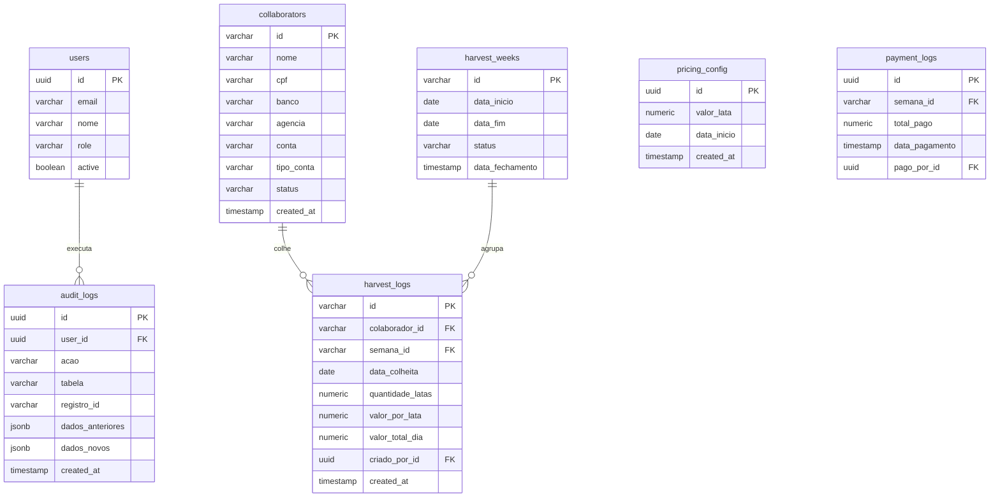

# DOCUMENTAÇÃO TÉCNICA E FUNCIONAL DE SISTEMA
## Fazenda Vista Bela — Sistema Inteligente de Gestão de Colheita de Café

---

## 1. Capa Profissional

* **Nome do Projeto:** Sistema Inteligente de Gestão de Colheita de Café
* **Cliente:** Fazenda Vista Bela
* **Desenvolvedora:** DG TECH — SOLUÇÕES TECNOLÓGICAS
* **Versão do Documento:** 1.0.0
* **Data:** Junho de 2026
* **Status do Projeto:** Aprovado para Implantação
* **Classificação de Segurança:** Confidencial / Corporativo

---

## 2. Apresentação Executiva

### Visão Geral do Sistema
O *Sistema Inteligente de Gestão de Colheita de Café* é uma solução integrada de hardware lógico e software desenvolvida pela **DG TECH — SOLUÇÕES TECNOLÓGICAS** para digitalizar a coleta física de safras, automatizar a contabilidade agrícola e otimizar folhas de pagamento de colaboradores rurais da Fazenda Vista Bela. 

### O Problema Resolvido
A gestão tradicional da colheita de café depende de anotações físicas feitas por cabos de turma (fiscais de balança) em blocos de papel sob condições climáticas adversas. Essa prática acarreta:
1. **Erros de Transcrição:** Divergências entre o anotado no campo e o digitado na planilha administrativa.
2. **Fraudes Operacionais:** Lançamentos de latas inexistentes ou duplicadas devido à falta de rastreabilidade.
3. **Morosidade Contábil:** O fechamento semanal da folha de pagamento exige conferência manual demorada de centenas de fichas de papel.
4. **Perda de Dados:** Rasuras ou extravios de anotações sob intempéries (chuva e sol intenso).

### Benefícios e Ganhos Operacionais
* **Resiliência Mobile (Offline-first):** O sistema opera em áreas remotas do cafezal sem conexão com a internet. Os registros são guardados localmente e sincronizados de forma assíncrona ao reaver rede.
* **Validação Cadastral Rígida:** Elimina o cadastro de trabalhadores com dados bancários inconsistentes ou CPFs inválidos através de verificação matemática.
* **Automação Contábil e Redução de Erros:** O processamento da folha salarial semanal ocorre de forma automática com base nas pesagens aprovadas, reduzindo o tempo de fechamento administrativo de dias para poucos minutos.
* **Rastreabilidade e Segurança:** Todo lançamento possui autoria (ID do Cabo), registro geográfico lógico e imutabilidade após a aprovação da semana contábil.

---

## 3. Escopo do Projeto

### 3.1. Escopo Incluído
* **Controle de Acesso (RBAC):** Login com níveis de privilégio segregados para Administradores, Gerentes, Fiscais/Cabos e Financeiro.
* **Cadastro e Importação:** Formulários com normalização e máscara de CPF, conta PIX dinâmica e importador em lote de planilhas Excel (XLSX).
* **Pesagem de Campo:** Lançamento rápido de volumes de latas colhidas (com incrementos de 0.5 lata) e cálculo de valores em tempo real.
* **Governança Temporal (Ciclos):** Criação e automação de semanas operacionais (Sexta-feira a Quinta-feira) com transições automáticas ou encerramentos manuais nativos.
* **Auditoria de Conferência:** Visualização dos dados em formato de sanfona (accordion) expandível por colaborador com bloqueio estrito contra alterações de semanas homologadas.
* **Processamento de Pagamentos:** Filtros de planilha por bancos destinatários, impressão de recibos em lote no formato horizontal (Landscape A4) e fechamento do ciclo contábil.
* **Relatórios e BI:** Filtros de data, colhedor, banco, faixa de latas e ordenação de colunas com exportação síncrona XLSX.
* **Backup de Segurança:** Exportação JSON criptografada no cliente usando algoritmo **AES-GCM de 256 bits** (PBKDF2, 100 mil iterações) e restauração compatível.

### 3.2. Escopo Futuro (Roadmap)
* **Integração com Balanças Inteligentes:** Conexão direta via Bluetooth/LORA para ler o peso das latas sem inserção manual.
* **Geolocalização por Lançamento:** Registro das coordenadas GPS exatas do cafezal de onde o lote de café foi recolhido.
* **Pagamento Automatizado via API Pix:** Integração com o banco parceiro para liquidação instantânea em lote das remessas de pagamento.

### 3.3. Escopo Excluído
* **Gestão de Estoque de Insumos:** Controle de fertilizantes, sementes e defensivos agrícolas.
* **Vendas e Trading de Café:** Gestão de contratos futuros de café, exportação e negociação de commodities.
* **Gestão de Frota e Maquinário:** Controle de consumo de combustível e manutenção de tratores e caminhões.

---

## 4. Objetivos de Negócio

Para mensurar o impacto do sistema na Fazenda Vista Bela, foram definidos os seguintes indicadores de desempenho (KPIs):

| Indicador | Objetivo | Métrica de Controle |
| :--- | :--- | :--- |
| **Produtividade da Balança** | Aumentar em 25% a velocidade da fila de pesagem | Tempo médio por colhedor na balança (meta: < 30 segundos) |
| **Integridade de Lançamentos** | Reduzir a zero os erros de digitação e fraudes de latas | Quantidade de pesagens contestadas ou alteradas após lançamento |
| **Eficiência Contábil** | Reduzir em 90% o tempo de fechamento financeiro | Tempo decorrido de auditoria e liberação de recibos (meta: < 1 hora) |
| **Consistência Cadastral** | Garantir 100% das transferências bancárias sem estorno | Percentual de pagamentos rejeitados por erro de agência, conta ou CPF |
| **Rastreabilidade** | Garantir histórico completo de operações | Percentual de lançamentos com rastreabilidade de autoria (meta: 100%) |

---

## 5. Requisitos Funcionais

A tabela a seguir consolida os **50 requisitos funcionais** obrigatórios para o desenvolvimento do sistema:

| ID | Requisito | Descrição | Prioridade | Regra de Negócio Associada |
| :--- | :--- | :--- | :--- | :--- |
| **RF-001** | Autenticação de Usuário | Permitir que usuários façam login no sistema informando e-mail e senha cadastrados. | Alta | Apenas usuários ativos com credenciais válidas acessam o sistema. |
| **RF-002** | Recuperação de Senha | Permitir que o administrador resete a senha de acesso de qualquer operador. | Média | A nova senha temporária deve ser gerada e enviada via canal seguro. |
| **RF-003** | Cadastro de Colhedor | Registrar novos colhedores na base informando ID, Nome, CPF e Dados Bancários. | Alta | Nome em UPPERCASE. CPF exclusivo e validado matematicamente. |
| **RF-004** | Edição de Colhedor | Permitir alteração de dados cadastrais e de pagamento de colhedores existentes. | Alta | Apenas administrador ou gerente pode destravar campos no botão "Editar". |
| **RF-005** | Inativação de Colhedor | Permitir inativar logicamente um colhedor da lista ativa (soft delete). | Alta | Colhedor inativado não pode receber novos lançamentos de pesagem. |
| **RF-006** | Exclusão de Colhedor | Excluir fisicamente o cadastro de um colhedor que não tenha lançamentos vinculados. | Média | Impede exclusão se o colhedor possuir histórico de pesagens (integridade). |
| **RF-007** | Busca de Colhedor | Filtrar tabela de colaboradores por Nome, CPF ou ID em tempo real. | Alta | Suporte a autocomplete dinâmico e preenchimento via tecla Tab. |
| **RF-008** | Navegação por Teclado | Permitir navegar entre colhedores na lista usando setas Cima/Baixo. | Baixa | A tecla Enter abre a ficha cadastral do registro selecionado. |
| **RF-009** | Cadastro Rápido On-The-Fly | Permitir cadastrar trabalhador a partir da tela de pesagem de latas. | Alta | Formulário popup simplificado para evitar travamento da fila na balança. |
| **RF-010** | Importação de Excel | Importar cadastro de colaboradores em lote via arquivo de planilha XLSX. | Média | Valida CPFs e dados bancários de cada linha antes de persistir no banco. |
| **RF-011** | Registro de Pesagem | Lançar a quantidade de latas colhidas por colaborador no dia selecionado. | Alta | Aceita incrementos decimais de 0,5 em 0,5 lata. |
| **RF-012** | Edição de Pesagem | Permitir alterar o volume de latas ou data de uma pesagem cadastrada. | Alta | Permitido apenas se a respectiva semana contábil estiver "Aberta". |
| **RF-013** | Exclusão de Pesagem | Remover um registro de pesagem incorreto do histórico do dia. | Alta | Bloqueado se a semana do registro estiver fechada ou paga. |
| **RF-014** | Cálculo em Tempo Real | Projetar o valor acumulado da pesagem conforme a digitação da lata ocorre. | Alta | Aplica o preço do dia: `quantidade * preco_lata_vigente`. |
| **RF-015** | Data Retroativa | Permitir registro de pesagens com datas anteriores à data de hoje. | Média | Data deve pertencer a uma semana de colheita com status "Aberta". |
| **RF-016** | Preço Vigente Reativo | Carregar reativamente o valor operacional da lata para a data selecionada. | Alta | Altera o preço projetado assim que o fiscal muda a data no input. |
| **RF-017** | Filtro de Recentes do Cabo | Exibir apenas pesagens criadas pelo cabo logado no dia atual para perfil cabo. | Alta | Filtro dinâmico: `criado_por_id == cabo.id AND data == hoje`. |
| **RF-018** | Visualização Geral de Recentes | Exibir lançamentos diários de todos os cabos para administradores. | Alta | Admins visualizam o montante consolidado de todos os fiscais. |
| **RF-019** | Sincronização Manual | Permitir forçar o reenvio de logs salvos no IndexedDB local para a nuvem. | Alta | Disparado pelo clique no botão de status de conexão no topo da tela. |
| **RF-020** | Relatório Diário PDF | Exportar relatório de produção diária de colheita no formato Portrait A4. | Média | Consolida volumes, preços e totais financeiros do dia em PDF. |
| **RF-021** | Abertura Automática de Ciclo | Iniciar novo ciclo semanal na sexta-feira às 00:00:00 automaticamente. | Alta | Gerenciado pelo robô cron background checker (cycleManager). |
| **RF-022** | Encerramento Automático | Fechar semana ativa na quinta-feira às 23:59:30 automaticamente. | Alta | Status avança para "fechada", bloqueando novas inserções de campo. |
| **RF-023** | Encerramento Manual | Forçar o encerramento do ciclo ativo por meio de botão administrative. | Alta | Exige confirmação em caixa pop-up de segurança antes de fechar. |
| **RF-024** | Reabertura de Ciclo | Permitir reabrir uma semana fechada retornando o status para "aberta". | Alta | Apenas se o status da semana for diferente de "paga". |
| **RF-025** | Resumos Semanais | Exibir resumos consolidados de latas e valores a pagar na conferência. | Alta | Agrupado por colaborador dentro da semana operacional ativa. |
| **RF-026** | Detalhamento Sanfona | Expandir linha de colaborador na conferência para visualizar lançamentos. | Média | Exibe a lista analítica diária (pesos, datas e cabo que pesou). |
| **RF-027** | Aprovação de Ciclo | Homologar semana na conferência avançando status para "em_conferencia". | Alta | Trava de escrita definitiva para fiscais de campo. |
| **RF-028** | Filtro Bancário de Pagamentos | Segregar planilha de pagamentos em abas por instituição financeira. | Alta | Abas: Pix, Banco do Brasil, Itaú, Bradesco, Santander, etc. |
| **RF-029** | Recibos em Lote | Exportar PDFs individuais de recibos bancários no formato Landscape A4. | Média | Gera e baixa de forma sequencial arquivos separados por instituição. |
| **RF-030** | Confirmar Pagamento | Marcar semana contábil como paga alterando status para "paga". | Alta | Registra data/hora da quitação definitiva. Bloqueio total do ciclo. |
| **RF-031** | Relatórios Avançados | Filtrar dados históricos por nome, datas, bancos e faixas de volumes. | Alta | Permite minerar registros agregados de safras passadas. |
| **RF-032** | Ordenação de Relatórios | Ordenar tabela de relatórios clicando nos cabeçalhos das colunas. | Média | Ordena por ID, Data, Colhedor, Volume ou Valor Financeiro. |
| **RF-033** | Exportação XLSX | Exportar o resultado dos relatórios filtrados para arquivo Excel (XLSX). | Alta | Geração de planilha binária executada no navegador do operador. |
| **RF-034** | Parâmetro de Preço | Cadastrar novo preço pago por lata com respectiva data de validade. | Alta | O sistema impede datas de início no futuro. |
| **RF-035** | Histórico de Preços | Exibir lista de preços antigos com destaque para a tarifa atual vigente. | Média | Permite auditoria de preços aplicados na safra. |
| **RF-036** | Assistente de Bancos | Autocompletar código de compensação COMPE ao digitar nome do banco. | Média | Nubank preenche 260, Bradesco 237, Itaú 341, Banco do Brasil 001, etc. |
| **RF-037** | Cadastro de Usuário | Cadastrar contas de acesso para operadores rurais e fiscais. | Alta | Exige e-mail, nome, CPF completo e nível de permissão (role). |
| **RF-038** | Geração de Login Automático | Gerar login e-mail automaticamente combinando nome e 5 dígitos do CPF. | Alta | Padrão gerado: `nome-12345@fvb.com`. |
| **RF-039** | Geração de Senha Inicial | Definir senha padrão do usuário cadastrado como o CPF completo formatado. | Alta | Senha inicial contém pontos e traço do CPF para primeiro acesso. |
| **RF-040** | Inativação de Usuário | Suspender login de operador alterando status para inativo no painel. | Alta | Usuário inativado tem seu acesso de login negado imediatamente. |
| **RF-041** | Backup de Dados | Exportar tabelas do Supabase em arquivo de backup estruturado JSON. | Alta | Download direto na máquina cliente. |
| **RF-042** | Backup Criptografado | Criptografar dados confidenciais de CPFs e contas no backup JSON. | Alta | Criptografia AES-GCM 256 bits cliente-side usando senha forte do operador. |
| **RF-043** | Restauração de Dados | Fazer upload e restaurar backup JSON de volta para o Supabase. | Alta | Atualiza colaboradores, semanas, preços e logs operacionais. |
| **RF-044** | Descriptografia de Restauro | Solicitar senha para restaurar backups que foram salvos criptografados. | Alta | Valida senha inserida e descriptografa chaves antes de enviar à nuvem. |
| **RF-045** | Seletores de Chave PIX | Exibir chave PIX condizente com a chave cadastrada (CPF, Celular, E-mail). | Média | Campo reage ocultando dados de agência e conta. |
| **RF-046** | Indicador Visual de Conexão | Exibir card reativo "ONLINE" ou "OFFLINE" no topo do sistema. | Alta | Monitora a API `navigator.onLine` do navegador para controle local. |
| **RF-047** | Controle de Sessão | Efetuar logout automático do usuário após período de inatividade. | Média | Desconecta e limpa cache de credenciais locais por segurança. |
| **RF-048** | Validação de CPF Único | Impedir a gravação de colaboradores que compartilhem o mesmo CPF. | Alta | Bloqueia novos cadastros caso o CPF já exista na tabela de ativos. |
| **RF-049** | Logs de Auditoria | Registrar toda inserção, edição ou exclusão de pesagem com autoria e data. | Alta | Logs gravados em tabela remota para auditoria fiscalizadora. |
| **RF-050** | Impressão de Produção Diária | Enviar relatório em PDF gerado diretamente para a impressora padrão. | Baixa | Integrado com a visualização do arquivo PDF. |

---

## 6. Requisitos Não Funcionais

A seguir são elencados os **30 requisitos não funcionais** do sistema, que definem premissas de segurança, performance e infraestrutura:

| ID | Categoria | Descrição | Métrica / Critério de Aceitação |
| :--- | :--- | :--- | :--- |
| **RNF-001** | Disponibilidade | O sistema deve estar operacional para uso administrativo e de campo. | Disponibilidade de 99.7% do banco de dados remanescente (SLA Supabase/Oracle Cloud). |
| **RNF-002** | Resiliência de Rede | O sistema deve permitir o registro de dados mesmo sem conexão de internet. | Uso obrigatório do banco IndexedDB com sync assíncrono. |
| **RNF-003** | Tempo de Resposta | Resposta das requisições de gravação no banco de dados local. | Tempo de resposta menor que 50ms (transação local). |
| **RNF-004** | Latência de Busca | Resposta do input de pesquisa e filtros por autocomplete na tela. | Latência máxima de 100ms para renderizar a filtragem de dados. |
| **RNF-005** | Compatibilidade Mobile | O aplicativo deve se adaptar a telas de smartphones de pequeno porte. | Suporte a larguras de tela de 360px a 1080px (responsivo total). |
| **RNF-006** | Limitação de Cache | Cache de requisições de listas estáticas (como lista de bancos e colhedores). | Persistência local no estado para reduzir chamadas desnecessárias. |
| **RNF-007** | Segurança de Login | Criptografia de senhas de operadores rurais no banco de dados. | Armazenamento de hash seguro criptografado com algoritmo bcrypt. |
| **RNF-008** | Autenticação Segura | Validação de requisições nas rotas protegidas da API administrativa. | Utilização de Tokens JWT (JSON Web Tokens) com expiração de 12 horas. |
| **RNF-009** | Criptografia em Trânsito | Proteção dos pacotes de dados transmitidos entre coletores e a nuvem. | Uso obrigatório de protocolo seguro HTTPS / TLS 1.3. |
| **RNF-010** | Criptografia de Backup | Algoritmo simétrico para codificação de CPFs e contas no download de backup. | Uso de **AES-GCM de 256 bits** (Web Crypto API) com PBKDF2 (100k iterações). |
| **RNF-011** | Proteção Contra Brute-Force | Bloqueio de acessos recorrentes malsucedidos de login. | Bloquear IP temporariamente por 15 minutos após 5 tentativas falhas. |
| **RNF-012** | Integridade Operacional | Regra de integridade referencial para dados contábeis. | Banco remoto impede alterações em registros cujas semanas estejam fechadas. |
| **RNF-013** | Logs de Erros | Registro de falhas de processamento e exceptions do sistema. | Envio de logs críticos para monitoramento centralizado Sentry/Datadog. |
| **RNF-014** | Legibilidade Visual | Legibilidade da tela de pesagem sob luz do dia no cafezal. | Fontes ampliadas (3xl - 30px) e contraste de cores AA na escala WCAG. |
| **RNF-015** | Consumo de Bateria | Minimização de consumo energético dos smartphones no campo. | Evitar loops e polling ativo na tela de colheita enquanto estiver offline. |
| **RNF-016** | Retenção de Dados Locais | Proteção de dados no aparelho em caso de desligamento inesperado. | IndexedDB deve gravar dados a cada clique no botão "Lançar Colheita". |
| **RNF-017** | Escalabilidade Vertical | Capacidade de suportar aumento de requisições no Supabase. | Banco de dados PostgreSQL configurado para auto-scale de memória. |
| **RNF-018** | Escalabilidade Horizontal | Suporte para múltiplos fiscais lançando pesagens simultaneamente. | Servidor NestJS configurado em Docker rodando com balanceamento de carga Nginx. |
| **RNF-019** | Portabilidade do Navegador | Compatibilidade com os navegadores web mais utilizados no mercado. | Suporte completo para Google Chrome, Safari, Firefox e Microsoft Edge. |
| **RNF-020** | Conformidade LGPD | Tratamento de dados confidenciais dos trabalhadores rurais. | Criptografia de CPF e dados bancários nas tabelas e restrição de acesso por RBAC. |
| **RNF-021** | Tamanho de Arquivos | Peso total de transferência dos scripts iniciais da aplicação (Bundle Size). | Pacote JavaScript inicial gzipado não deve exceder 600KB. |
| **RNF-022** | Backup Automático Nuvem | Cópia de segurança do banco de dados central Supabase. | Backup automático diário configurado às 02:00h com retenção de 30 dias. |
| **RNF-023** | Controle de Concorrência | Resolução de conflitos de IDs no envio de dados assíncronos offline. | Uso de UUID gerado no cliente como chave primária para logs de colheita. |
| **RNF-024** | Auditoria e Rastreabilidade | Rastreamento de alterações em dados sensíveis do sistema. | Toda alteração de cadastro ou pesagem gera log detalhado em tabela separada. |
| **RNF-025** | Limitação de Payload | Limite de tamanho de arquivos aceitos na importação de planilhas. | Bloquear uploads de planilhas XLSX com tamanho superior a 10MB. |
| **RNF-026** | Internacionalização | Idioma e formatação de localização padrão da plataforma. | Sistema em Português do Brasil (pt-BR) com fuso horário GMT-3 (Brasília). |
| **RNF-027** | Padrão de Design | Padronização visual da interface administrativa e relatórios. | Uso de fontes Google Fonts (Inter e Outfit) e biblioteca Lucide Icons. |
| **RNF-028** | Recuperação de Desastres (DRP) | Tempo para reestabelecimento de serviço após pane geral de hardware. | RTO (Recovery Time Objective) < 2 horas; RPO (Recovery Point Objective) < 24 horas. |
| **RNF-029** | Testabilidade | Nível de cobertura de testes automatizados do código-fonte. | Cobertura mínima de 80% de testes unitários nas regras de negócio contábeis. |
| **RNF-030** | Facilidade de Implantação | Facilidade para implantar atualizações em produção. | Implantação automatizada via pipeline CI/CD GitHub Actions em contêineres Docker. |

---

## 7. Regras de Negócio

As regras de negócio (RN) definem as diretrizes fundamentais que regem o comportamento operacional do software:

* **RN-001 (CPF Único):** Não é permitido o cadastro de dois colaboradores ativos com o mesmo CPF. CPFs digitados incorretos ou em formato inválido devem ser rejeitados síncronamente pela validação matemática de dígitos verificadores. A única exceção aceita é o CPF `000.000.000-00` para trabalhadores temporários emergenciais sem documentação.
* **RN-002 (Identificador Exclusivo):** Cada colaborador cadastrado recebe um número de ID de cadastro sequencial e único gerado no momento de sua criação.
* **RN-003 (Dados Bancários Obrigatórios):** O colaborador só pode ser ativo no sistema se preencher dados bancários completos de destino (banco, agência, conta e tipo de conta) ou chave PIX válida.
* **RN-004 (Vigência de Preço):** Toda pesagem de colheita registrada adota o preço unitário da lata que estivesse parametrizado como vigente na data em que a pesagem ocorreu. Preços parametrizados com início de vigência no futuro são rejeitados no cadastro.
* **RN-005 (Semana Produtiva Contábil):** A semana de colheita inicia impreterivelmente na **Sexta-feira às 00:00:00** e encerra-se na **Quinta-feira às 23:59:59**. A transição e criação do novo período é executada síncronamente às quintas-feiras às **23:59:30** pelo serviço *cycleManager*.
* **RN-006 (Fechamento e Liberação):** Concluído o período contábil na quinta-feira, a semana é alterada para `fechada` e o fiscal de campo perde o acesso para registrar, editar ou excluir lançamentos daquela semana.
* **RN-007 (Homologação Administrativa):** O status da semana contábil avança de `fechada` para `em_conferencia` após a aprovação manual do coordenador de auditoria financeira no escritório.
* **RN-008 (Cronograma de Pagamento):** O pagamento dos valores acumulados em uma determinada semana operacional deve ser processado e quitado na **Sexta-feira da semana contábil subsequente**.
* **RN-009 (Imutabilidade de Períodos Pagos):** Assim que o administrador confirma o pagamento do ciclo contábil, o status do período é promovido para `paga` e o sistema bloqueia qualquer alteração lógica, deleção ou inserção de dados retroativos vinculados a este ciclo contábil para garantir a integridade fiscal da Fazenda Vista Bela.
* **RN-010 (Cadastro On-The-Fly):** O cadastro simplificado de colhedores no cafezal (pesagem) persiste o trabalhador diretamente no IndexedDB e gera um ID temporário sequencial que será validado e persistido no Supabase assim que a sincronização ocorrer.

---

## 8. Casos de Uso

Abaixo são detalhados **20 casos de uso** do sistema que mapeiam as interações entre os atores e a plataforma:

### UC-001: Autenticar Operador no Sistema
* **Objetivo:** Permitir o acesso seguro dos usuários às telas do sistema.
* **Atores:** Administrador, Gerente, Encarregado, Operador, Financeiro.
* **Fluxo Principal:**
  1. O usuário acessa a tela de login.
  2. O usuário informa e-mail e senha.
  3. O sistema valida as credenciais contra a tabela `users`.
  4. O sistema gera o token JWT e carrega o perfil (RBAC) correspondente.
  5. O usuário é redirecionado para a tela inicial (Dashboard).
* **Fluxo Alternativo (Credencial Inválida):**
  * No passo 3, caso a senha esteja incorreta ou o e-mail não exista, o sistema exibe alerta de erro e limpa os campos.
* **Exceção (Conta Inativa):**
  * Caso o usuário esteja marcado como inativo, o sistema bloqueia o login informando a suspensão da conta.
* **Resultado Esperado:** Usuário autenticado e redirecionado com segurança para o Dashboard de acordo com seu perfil.

### UC-002: Cadastrar Colaborador
* **Objetivo:** Adicionar um novo trabalhador rural para apontamentos de pesagens.
* **Atores:** Administrador, Gerente.
* **Fluxo Principal:**
  1. O usuário acessa o menu "Colhedores" e clica no botão "Novo Colaborador" (+).
  2. O usuário preenche Nome, CPF e Dados Bancários.
  3. O sistema valida se o CPF é único e se o documento é matematicamente consistente.
  4. O sistema converte o Nome digitado para UPPERCASE.
  5. O usuário clica em "Salvar".
  6. O sistema grava o registro e gera o ID incremental sequencial.
* **Fluxo Alternativo (Conta PIX):**
  * No passo 2, o usuário seleciona "PIX" como tipo de conta. O sistema esconde dados de banco/agência, exibindo tipo de chave e a chave PIX para preenchimento.
* **Exceção (CPF Duplicado ou Inválido):**
  * No passo 3, caso o CPF já exista ou falhe na validação dos dígitos verificadores, o sistema bloqueia a gravação exibindo mensagem de erro.
* **Resultado Esperado:** Colaborador persistido no banco de dados e disponível para lançamentos de colheita.

### UC-003: Registrar Pesagem de Campo
* **Objetivo:** Registrar o volume de latas de café colhido por um trabalhador.
* **Atores:** Encarregado (Cabo), Gerente, Administrador.
* **Fluxo Principal:**
  1. O fiscal acessa a tela "Registrar Colheita".
  2. O fiscal seleciona a data e busca o colaborador por ID, Nome ou CPF.
  3. O fiscal insere a quantidade de latas colhidas (ex: 8.5).
  4. O sistema exibe o preço unitário vigente do dia e projeta o valor financeiro acumulado.
  5. O fiscal clica em "Lançar Colheita".
  6. O sistema persiste a transação localmente no IndexedDB.
* **Fluxo Alternativo (Modo Online):**
  * No passo 6, se houver rede, o sistema envia o log ao Supabase e exibe a etiqueta "Nuvem Verde" (Sincronizado).
* **Exceção (Ciclo Fechado):**
  * Caso a data selecionada pertença a um ciclo contábil que já foi aprovado ou pago, o sistema nega a gravação.
* **Resultado Esperado:** Pesagem gravada localmente com sucesso.

### UC-004: Cadastrar Colhedor On-The-Fly
* **Objetivo:** Cadastrar um trabalhador diretamente no cafezal sem interromper a pesagem.
* **Atores:** Encarregado (Cabo).
* **Fluxo Principal:**
  1. O fiscal está na tela de pesagem de campo e digita um colaborador inexistente.
  2. O sistema exibe o botão "Cadastrar Rápido".
  3. O fiscal clica no botão; um modal popup simplificado abre na tela.
  4. O fiscal digita o Nome, CPF e dados de conta.
  5. O fiscal clica em "Salvar Cadastro".
  6. O sistema insere o registro e retorna o fiscal ao fluxo de pesagem selecionando o novo trabalhador.
* **Exceção (CPF em Branco):**
  * Se o fiscal não souber o CPF do trabalhador na hora, o sistema sugere preenchimento com a exceção `000.000.000-00` para liberação do cadastro.
* **Resultado Esperado:** Colaborador inserido na lista temporária local de pesagem.

### UC-005: Fechamento Manual de Ciclo
* **Objetivo:** Bloquear novos lançamentos em uma semana operacional encerrada.
* **Atores:** Administrador, Gerente.
* **Fluxo Principal:**
  1. O administrador acessa a tela de "Ciclos de Colheita".
  2. O administrador seleciona o ciclo corrente ("Aberto").
  3. O administrador clica em "Encerrar Ciclo".
  4. O sistema exibe uma caixa pop-up nativa com confirmação de segurança.
  5. O administrador confirma a operação.
  6. O sistema altera o status da semana para `fechada` e registra data e hora de fechamento.
* **Resultado Esperado:** Período congelado impedindo lançamentos de campo pelos fiscais.

### UC-006: Reabrir Ciclo Contábil
* **Objetivo:** Destravar edições e novos lançamentos de latas para uma semana encerrada.
* **Atores:** Administrador.
* **Fluxo Principal:**
  1. O administrador abre a tela "Ciclos de Colheita" e seleciona um ciclo com status "fechada" ou "em_conferencia".
  2. O administrador clica no botão "Reabrir Ciclo".
  3. O sistema atualiza o status do período de volta para `aberta`.
  4. O sistema dispara evento que atualiza o terminal dos fiscais de campo.
* **Exceção (Ciclo Pago):**
  * Caso o status do ciclo selecionado seja `paga`, o sistema oculta o botão de reabertura, bloqueando a ação.
* **Resultado Esperado:** Status da semana revertido para aberto com sucesso.

### UC-007: Conferir e Auditar Fechamento Semanal
* **Objetivo:** Validar a folha de produção consolidada antes da liberação financeira.
* **Atores:** Gerente, Financeiro, Administrador.
* **Fluxo Principal:**
  1. O usuário acessa a tela "Conferência".
  2. O sistema exibe a lista unificada de trabalhadores e seus totais de latas acumuladas.
  3. O usuário clica em um colaborador para expandir o detalhamento diário de pesagens.
  4. O usuário valida os valores e clica em "Aprovar Folha".
  5. O status da semana contábil avança para `em_conferencia`.
* **Resultado Esperado:** Ciclo semanal homologado para faturamento financeiro.

### UC-012: Cadastrar Novo Operador no Sistema
* **Objetivo:** Cadastrar uma credencial de acesso ao painel do sistema.
* **Atores:** Administrador.
* **Fluxo Principal:**
  1. O administrador acessa a aba "Equipe" em Configurações.
  2. O administrador preenche Nome, CPF, nível de acesso (Admin ou Cabo) do usuário.
  3. O sistema gera automaticamente o login de e-mail e a senha inicial baseados no CPF.
  4. O administrador clica em "Cadastrar Usuário".
  5. O sistema persiste a conta na nuvem.
* **Resultado Esperado:** Credencial de operador criada e disponível para login.

---

## 9. Personas e Perfis de Usuários

A governança do sistema é protegida por controle de acesso baseado em perfis (RBAC - Role Based Access Control), limitando a visibilidade de telas e botões de acordo com o cargo:

```
[ ADMIN ] ──────► Módulo de Configurações, Equipe, Backups e Fechamentos
    │
[ GERENTE ] ────► Auditoria de Fichas de Colhedores, Reabertura e Relatórios
    │
[ FINANCEIRO ] ──► Exportação de Lotes Bancários e Quitação de Ciclos
    │
[ CABO/FISCAL ] ─► Apenas Registrar Colheita e Cadastro On-the-fly (Mobile)
```

### 9.1. Administrador (AD)
* **Responsabilidades:** Configuração global de preços vigentes, governança de banco de dados, backups criptografados e cadastros de credenciais de usuários da fazenda.
* **Permissões:** Total acesso leitura/escrita a todas as telas do sistema.
* **Restrições:** Nenhuma.
* **Módulos Acessados:** Dashboard, Colhedores, Registrar Colheita, Ciclos de Colheita, Conferência, Pagamentos, Relatórios e Configurações (com aba Equipe e Backups).

### 9.2. Gerente (GE)
* **Responsabilidades:** Supervisão diária do cafezal, controle de rendimento e auditoria de cadastros.
* **Permissões:** Criar, ler e editar colhedores, registrar pesagens de campo, encerrar ciclos contábeis abertos e emitir relatórios de produção em PDF.
* **Restrições:** Não acessa a aba "Equipe" (usuários) nem a seção de backup/restauro em configurações.
* **Módulos Acessados:** Dashboard, Colhedores, Registrar Colheita, Ciclos de Colheita, Conferência, Pagamentos e Relatórios.

### 9.3. Encarregado / Cabo de Turma (CB)
* **Responsabilidades:** Apontamento diário e pesagem física de latas de café no cafezal de forma rápida e segura.
* **Permissões:** Registro de coletas (pesagens) e cadastro rápido *on-the-fly* de colhedores.
* **Restrições:** Não visualiza Dashboard analítico, não visualiza abas de dados bancários de colaboradores, não acessa relatórios financeiros nem telas de parametrização de preço.
* **Módulos Acessados:** Apenas a tela **"Registrar Colheita"**. As outras opções de menu são ocultadas e rotas são bloqueadas por middleware.

### 9.4. Financeiro (FI)
* **Responsabilidades:** Conferência contábil semanal de saldos consolidados e processamento bancário da folha de pagamentos da safra.
* **Permissões:** Visualização do Dashboard de custos, conferência do ciclo semanal fechado, exportação de recibos de faturamento em lote A4 e confirmação de pagamento definitivo (quitação).
* **Restrições:** Não realiza lançamentos de pesagens de campo, não altera tarifas e não acessa a gestão de equipe ou ferramentas de backup.
* **Módulos Acessados:** Dashboard, Conferência, Pagamentos e Relatórios.

---

## 10. Modelagem de Dados

A arquitetura do banco de dados relacional (PostgreSQL) é composta por sete entidades projetadas para garantir consistência cadastral e integridade referencial:



---

## 11. Dicionário de Dados

Abaixo está o dicionário técnico detalhado de todas as colunas do banco de dados relacional:

### Tabela: `users` (Credenciais e Perfis de Acesso)
| Nome do Campo | Tipo de Dado | Tamanho | Obrigatoriedade | Descrição | Exemplo de Preenchimento |
| :--- | :--- | :--- | :--- | :--- | :--- |
| `id` | UUID | 36 | Sim (PK) | Chave primária de identificação do usuário. | `3c8d10b9-8e42-4f9e-aa02-8f96cf896434` |
| `email` | VARCHAR | 255 | Sim | Endereço de e-mail exclusivo de acesso. | `marcos-12345@fvb.com` |
| `nome` | VARCHAR | 150 | Sim | Nome completo do operador. | `MARCOS ALBUQUERQUE CARDOSO` |
| `role` | VARCHAR | 20 | Sim | Nível de privilégio de acesso (RBAC). | `cabo` (ou `admin`, `gerente`, `financeiro`) |
| `active` | BOOLEAN | 1 | Sim | Status lógico do acesso de login do operador. | `true` |

### Tabela: `collaborators` (Trabalhadores da Colheita)
| Nome do Campo | Tipo de Dado | Tamanho | Obrigatoriedade | Descrição | Exemplo de Preenchimento |
| :--- | :--- | :--- | :--- | :--- | :--- |
| `id` | VARCHAR | 20 | Sim (PK) | Número sequencial único de cadastro na fazenda. | `142` |
| `nome` | VARCHAR | 250 | Sim | Nome completo do colhedor (em maiúsculas). | `SEBASTIAO GOMES DA SILVA` |
| `cpf` | VARCHAR | 14 | Sim | Documento CPF com máscara padrão. | `123.456.789-00` |
| `banco` | VARCHAR | 100 | Sim | Nome ou código oficial do banco de recebimento. | `Itaú Unibanco S.A.` |
| `agencia` | VARCHAR | 20 | Não | Código identificador da agência bancária. | `0412` |
| `conta` | VARCHAR | 30 | Não | Número da conta bancária de recebimento. | `12450-8` |
| `tipo_conta` | VARCHAR | 30 | Sim | Classificação da conta bancária ou PIX. | `corrente` (ou `poupança`, `pix`) |
| `status` | VARCHAR | 20 | Sim | Estado do colaborador no sistema de safra. | `ativo` (ou `inativo`) |
| `created_at` | TIMESTAMP | 8 | Sim | Registro de data e hora em que foi cadastrado. | `2026-06-02 10:14:00` |

### Tabela: `harvest_weeks` (Ciclos Semanais de Safra)
| Nome do Campo | Tipo de Dado | Tamanho | Obrigatoriedade | Descrição | Exemplo de Preenchimento |
| :--- | :--- | :--- | :--- | :--- | :--- |
| `id` | VARCHAR | 30 | Sim (PK) | Código identificador da semana operacional. | `2026-W22` |
| `data_inicio` | DATE | 4 | Sim | Data inicial da semana contábil (Sexta-feira). | `2026-05-29` |
| `data_fim` | DATE | 4 | Sim | Data final da semana contábil (Quinta-feira). | `2026-06-04` |
| `status` | VARCHAR | 20 | Sim | Status operacional da semana de colheita. | `aberta` (ou `fechada`, `em_conferencia`, `paga`) |
| `data_fechamento`| TIMESTAMP | 8 | Não | Registro do momento exato do encerramento. | `2026-06-04 23:59:30` |

---

## 12. Diagrama Entidade Relacionamento (DER Textual)

* **Entidade Principal Colhedores (`collaborators`):**
  * Mantém relacionamento de **1 para muitos** com a tabela de lançamentos físicos de campo (`harvest_logs`).
* **Entidade Ciclos Operacionais (`harvest_weeks`):**
  * Mantém relacionamento de **1 para muitos** com a tabela de pesagens diárias (`harvest_logs`) para consolidação em fechamento de semanas contínuas.
  * Mantém relacionamento de **1 para 1** (ou muitos para 1 opcional) com as quitações financeiras (`payment_logs`).
* **Entidade Usuários (`users`):**
  * Relaciona-se de **1 para muitos** com os logs de auditoria (`audit_logs`) e pesagens de colheita (`harvest_logs`), gravando a autoria fiscal e operacional dos lançamentos de latas.

---

## 13. Arquitetura do Sistema

O sistema é construído seguindo uma arquitetura em camadas bem definida, assegurando a separação de responsabilidades (Separation of Concerns), modularidade e fácil escalabilidade.

```
┌────────────────────────────────────────────────────────┐
│                   NEXT.JS FRONTEND                     │
│  [PWA Views] ──► [Auth Context] ──► [Storage Wrapper]  │
└──────────────────────────┬─────────────────────────────┘
                           │ API Requests (HTTPS / JWT)
                           ▼
┌────────────────────────────────────────────────────────┐
│                   NESTJS BACKEND                       │
│  [Controllers] ──► [Services] ──► [Repository Layer]   │
└──────────────────────────┬─────────────────────────────┘
                           │ SQL Queries (PostgreSQL Driver)
                           ▼
┌────────────────────────────────────────────────────────┐
│                  POSTGRESQL DATABASE                   │
│   [Tables] ──► [Views] ──► [Secure Functions (RPC)]    │
└────────────────────────────────────────────────┘
```

### Tecnologias Utilizadas:
* **Frontend:** React, Next.js (App Router), TypeScript, Styled CSS / Tailwind CSS, Lucide Icons.
* **Backend:** Node.js, NestJS, Prisma ORM / TypeORM para abstração de banco.
* **Banco de Dados:** PostgreSQL relacional.
* **Infraestrutura e Deploy:** Docker (conteinerização), Linux (Ubuntu Server LTS), Nginx (Proxy reverso, compressão gzip e terminação SSL/TLS).
* **Versionamento:** GitHub (Gitflow workflow).
* **Hospedagem:** Instância dedicada na Oracle Cloud Infrastructure (OCI) com infraestrutura autogerenciada.

---

## 14. Fluxos Operacionais

### 14.1. Fluxo de Cadastro de Colaboradores
```
[ Início ] ──► Preencher Nome, CPF, Conta ──► Validação CPF/Pix
                                                     │
         ┌─────────────────── Não ───────────────────┤
         ▼                                           ▼ Sim
Corrigir Campos                      Gravar Banco e Gerar ID ──► [ Fim ]
```

### 14.2. Fluxo de Registro de Produção (Campo)
```
[ Início ] ──► Cabo busca Colhedor por ID ──► Digita Latas (ex: 12.5)
                                                     │
         ┌─────────────────── Não ───────────────────┤
         ▼                                           ▼ Sim
IndexedDB offline                     Sync automático ao reaver sinal Wi-Fi
                                                     │
                                                     ▼
                                            Salvar no Supabase ──► [ Fim ]
```

### 14.3. Fluxo de Fechamento e Pagamento Semanal
```
[ Início ] ──► cycleManager fecha ciclo contábil (Quinta 23:59:30)
                                     │
                                     ▼
                      Conferência expande colaboradores
                                     │
                                     ▼
                Aprovação bloqueia edições retroativas
                                     │
                                     ▼
                Exportação de recibos e Lotes por Banco
                                     │
                                     ▼
             Financeiro confirma quitação e status avança para "paga" ──► [ Fim ]
```

---

## 15. Dashboard e Indicadores

O painel administrativo apresenta métricas analíticas em tempo real:
1. **Produção Diária (Lats):** Volume de latas colhidas no dia atual em comparação com o mesmo dia da semana anterior.
2. **Produção Semanal Contínua:** Barra acumulada exibindo o total de latas da semana vigente (início na sexta-feira).
3. **Custo Estimado da Folha:** Previsão de desembolso financeiro calculado síncronamente multiplicando a produção acumulada pelo preço ativo da lata.
4. **Indicador de Produtividade Média:** Relação de latas por colaborador (útil para avaliar rendimento do cafezal e incentivos salariais).
5. **Ranking de Colhedores (Top 5):** Painel exibindo os colaboradores com maior volume colhido na semana contábil ativa.

---

## 16. Telas do Sistema

### 16.1. Tela de Login
* **Objetivo:** Autenticar operadores e cabos.
* **Componentes:** Input e-mail, input senha com botão de visibilidade (ícone de olho), botão de login, mensagem de erro de credenciais.
* **Validações:** Campos obrigatórios. E-mail com formato válido.

### 16.2. Tela de Colhedores
* **Objetivo:** Cadastro, pesquisa e visualização cadastral dos trabalhadores.
* **Componentes:** Caixa de busca com autocomplete por nome, tabela de colhedores cadastrados, modal de visualização segura (desativado por padrão), botão "Editar", seletor de conta bancária e chave PIX, botão "Importar Planilha".

### 16.3. Tela de Registrar Colheita (Mobile-First)
* **Objetivo:** Registro rápido de pesagens na balança pelo fiscal de campo.
* **Componentes:** Input data (sugere hoje), seletor de trabalhador por autocomplete, input de quantidade de latas com botões de incremento (+0.5 e -0.5), card de preço unitário e valor total diário em real-time, botão "Lançar Colheita", tabela de lançamentos recentes com selo de nuvem (verde para sincronizado e amarelo para local).

### 16.4. Tela de Configurações
* **Objetivo:** Parametrização e administração do ERP agrícola.
* **Componentes:** Configuração do valor operacional por lata e vigência, cadastro de instituições bancárias com assistente COMPE, cadastro e controle de acesso de equipe, ferramentas de backup com download JSON criptografado.

---

## 17. Segurança e Controlo de Acesso

### Autenticação JWT e Middleware RBAC
A segurança de rotas adota tokens de acesso JWT criptografados. As requisições HTTP aos endpoints carregam no Header as propriedades de validação do perfil do operador (RBAC), bloqueando requisições com privilégios insuficientes.

### Proteção de Backup com Criptografia Militar
Os backups JSON gerados localmente utilizam criptografia robusta **AES-GCM de 256 bits** para codificar CPFs, nomes e chaves PIX. A chave de decodificação é derivada por PBKDF2 com salt aleatório e 100.000 iterações, garantindo que o arquivo possa ser transmitido por e-mail ou armazenado na nuvem pública de forma totalmente blindada.

---

## 18. Documentação da API REST

### 18.1. Endpoint: `/auth/login`
* **Método:** `POST`
* **Finalidade:** Autenticar usuário e gerar token de acesso JWT.
* **Request Payload:**
```json
{
  "email": "marcos-12345@fvb.com",
  "password": "CPF_COMPLETO_SENHA"
}
```
* **Response Payload (Status 200 - Success):**
```json
{
  "token": "eyJhbGciOiJIUzI1NiIsInR5cCI6IkpXVCJ9...",
  "profile": {
    "id": "3c8d10b9-8e42-4f9e-aa02-8f96cf896434",
    "email": "marcos-12345@fvb.com",
    "nome": "MARCOS CARDOSO",
    "role": "cabo"
  }
}
```
* **Códigos de Retorno:**
  * `200 OK` — Autenticação realizada com sucesso.
  * `401 Unauthorized` — Senha incorreta ou usuário desativado.

### 18.2. Endpoint: `/api/collaborators`
* **Método:** `POST`
* **Finalidade:** Cadastrar colaborador rural na base de dados.
* **Headers:** `Authorization: Bearer <token>` (Requer papel admin ou gerente).
* **Request Payload:**
```json
{
  "nome": "Sebastiao Gomes da Silva",
  "cpf": "123.456.789-00",
  "banco": "Itaú Unibanco S.A.",
  "agencia": "0412",
  "conta": "12450-8",
  "tipo_conta": "corrente"
}
```
* **Response Payload (Status 201 - Created):**
```json
{
  "id": "142",
  "nome": "SEBASTIAO GOMES DA SILVA",
  "cpf": "123.456.789-00",
  "banco": "Itaú Unibanco S.A.",
  "agencia": "0412",
  "conta": "12450-8",
  "tipo_conta": "corrente",
  "status": "ativo",
  "created_at": "2026-06-02T18:15:30.000Z"
}
```

### 18.3. Endpoint: `/api/harvest`
* **Método:** `POST`
* **Finalidade:** Registrar lançamento de colheita diária.
* **Headers:** `Authorization: Bearer <token>`
* **Request Payload:**
```json
{
  "colaborador_id": "142",
  "data_colheita": "2026-06-02",
  "quantidade_latas": 15.5
}
```
* **Response Payload (Status 201 - Created):**
```json
{
  "id": "LCH-98124ACD",
  "colaborador_id": "142",
  "semana_id": "2026-W22",
  "data_colheita": "2026-06-02",
  "quantidade_latas": 15.5,
  "valor_por_lata": 22.50,
  "valor_total_dia": 348.75,
  "criado_por_id": "3c8d10b9-8e42-4f9e-aa02-8f96cf896434"
}
```

---

## 19. Plano de Testes

O plano de testes engloba a validação contínua da integridade e consistência lógica dos dados:
1. **Testes Unitários (Jest):** Focados nos algoritmos matemáticos de validação de CPF e no cálculo dinâmico da pluralização das latas no Dashboard.
2. **Testes Integrados (NestJS Testing Module):** Validação dos bloqueios de escrita do Supabase/PostgreSQL quando requisições de inserção de pesagens tentam salvar dados vinculados a semanas com status fechada ou paga.
3. **Testes de Segurança (OWASP ZAP / Pentest):** Verificação de integridade nas validações do token JWT e testes de injeção SQL no input de busca rápida de colaboradores.
4. **Testes de Carga (k6):** Simulação de 150 fiscais enviando dados locais sincronizados síncronamente para a nuvem de forma simultânea (teste de stress de concorrência e escalabilidade de conexões).

---

## 20. Roadmap de Evolução

* **MVP (Versão Atual):** Lançamento mobile offline-first (IndexedDB), normalização de CPFs, relatórios diários em PDF e exportação de planilha bancária segmentada em abas.
* **Versão 2.0:** Leitura automatizada por balança inteligente Bluetooth, mapa dinâmico de produtividade do cafezal no Dashboard, e geração e envio automatizado de holerite via WhatsApp para colaboradores rurais.
* **Versão 3.0:** Integração Pix em lote direta com a API do Banco Central para quitação instantânea dos pagamentos de colheita na sexta-feira contábil.

---

## 21. Manual do Usuário

### Ações Rápidas no Dia a Dia da Safra:
1. **Fiscal de Balança (Lançamento de Latas):**
   * Abra a tela "Registrar Colheita".
   * Digite o número de ID ou use a busca inteligente por Nome do trabalhador.
   * Insira a quantidade de latas recolhida. Se o trabalhador for novo no cafezal, clique no botão rápido "Cadastrar Rápido" e salve o cadastro antes de prosseguir com a pesagem.
   * Ao retornar para a sede à noite com conexão Wi-Fi activa, clique no botão "ONLINE / SINCRONIZAR" no topo da barra de tarefas para processar o envio dos lançamentos locais marcados com a nuvem amarela.
2. **Operador Administrativo / Financeiro (Fechamento e Liquidação):**
   * Transite para a aba "Conferência" nas quintas-feiras à tarde para validar as semanas fechadas.
   * Clique em "Aprovar" para congelar a semana contra lançamentos retroativos dos fiscais.
   * Acesse o menu "Pagamentos", navegue pelas abas bancárias organizadas e clique em "Gerar PDFs de Recibo" para obter os lotes de depósitos.
   * Após efetuar a liquidação financeira no Internet Banking, clique no botão verde "Confirmar Pagamento" para oficializar o encerramento do ciclo e atualizar o status contábil para "paga".

---

## 22. Manual do Administrador

### Configurações de Servidor e Ajustes Críticos:
* **Atualização do Preço de Lata:** Acesse "Configurações" > "Preço Operacional". Informe o valor e clique em salvar. Nunca insira vigências com datas no futuro.
* **Processo de Backup Criptografado:**
  * Acesse "Ferramentas de Backup".
  * Defina uma senha de segurança (obrigatória para criptografia militar AES-GCM 256 bits cliente-side).
  * Clique no botão azul "Fazer Backup" e salve o arquivo JSON em local seguro.
* **Restauração da Base de Dados:**
  * Clique no botão "Restaurar" e faça o upload do arquivo de backup JSON correspondente.
  * Se o backup foi encriptado, o sistema abrirá um prompt para digitação da senha de segurança. Digite a senha para liberar a restauração automática do banco.

---

## 23. Conclusão Executiva

O *Sistema Inteligente de Gestão de Colheita de Café* entrega à Fazenda Vista Bela uma infraestrutura moderna de controle de produção agrícola e automação financeira desenvolvida sob medida pela **DG TECH — SOLUÇÕES TECNOLÓGICAS**. 

Ao eliminar controles manuais de papel, mitigar erros de digitação por máscara e validações automáticas, e blindar o caixa contra lançamentos fraudulentos em períodos contábeis encerrados, a plataforma se consolida como uma ferramenta essencial de sustentabilidade operacional e governança corporativa no agronegócio moderno.

---

<div align="center">
  <p style="font-size: 10px; color: #888;">© 2026 **DG TECH — SOLUÇÕES TECNOLÓGICAS**. Todos os direitos reservados. "Fazenda Vista Bela - Sistema Inteligente de Gestão de Colheita de Café" é uma marca de propriedade intelectual de exclusividade da **DG TECH — SOLUÇÕES TECNOLÓGICAS**.</p>
</div>
